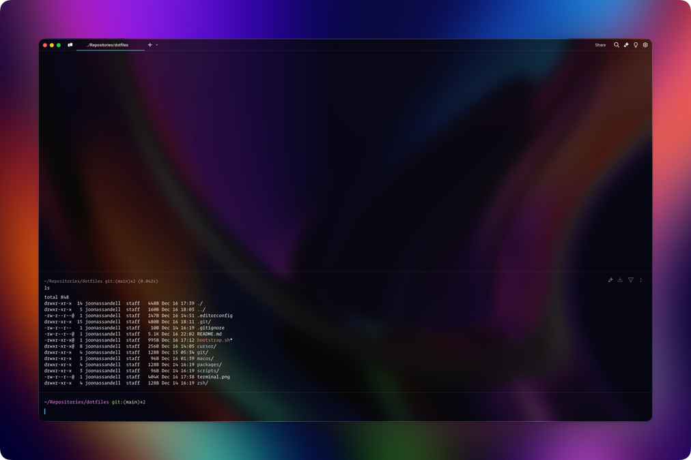

# Dotfiles of Joonas Sandell

I maintain this repository as my personal dotfiles. Last tested succesfully with Macbook Pro M4, macOS `Sequoia 15.1`.



## Getting started

Verify that you're connected to the internet and logged in to App Store.

```shell
# 1. Install brew and follow the instructions for adding `brew` to the path
/bin/bash -c "$(curl -fsSL https://raw.githubusercontent.com/Homebrew/install/HEAD/install.sh)"

# 2. Install git, and then a open new terminal window
brew install git

# 3. Create `Repositories` directory and clone this repository
mkdir ~/Repositories && cd ~/Repositories
git clone https://github.com/joonassandell/dotfiles.git && cd dotfiles

# 4. Setup and install packages, prepare to prompt password frequently as it maybe required
./bootstrap.sh
```

## Manual setup

<details>

<summary>
Perform manual configurations after completing the setup especially if setting up a new machine
</summary>

- [Synology Drive (NAS)](https://www.synology.com/en-global/dsm/feature/drive)
  - **Configure this before anything else!**
  - Check `Locally deleted files will be removed from your NAS` and `Use minimalist tray icon`
  - Check `Sync files and folders with the prefix "."` to all synced folders
  - Initially sync only the essential folders: `Drive/1Password` and `Joonas Sandell/Design Resources/Fonts`
- Keyboard shortcuts
  - Modifier Keys
    - Control key ^ → `Command ⌘`
    - Command ⌘ → `Control key ^`
    - Function (fn) / Globe → `Command ⌘`
    - Mission Control → `F12`
  - App Shortcuts → All Applications → `Sleep` → `^ ⌥ ⌘ Q` for [Stream Deck](https://vninja.net/2021/04/15/elgato-stream-deck-sleep-button)
  - Spotlight → Uncheck `Show Spotligh search` and `Show Finder search window`
  - Launchpad & Dock → Uncheck `Turn Dock hiding on/off`
  - Screenshots → Uncheck all the shortcuts
  - Input Sources → Uncheck all the shortcuts
- System Settings and related
  - Configure Lock Screen, Screen Saver, Background, Mouse Tracking/Scrolling speed and Hot corners
  - Accessibility → Zoom → Check `Use scroll gesture with modifier keys to zoom`
  - Finder sidebar: Add essential directories and remove Recents etc.
  - Install `Operator Mono` and other typefaces from NAS
  - If the keyboard layout is not recognized correctly: Run `sudo open /System/Library/CoreServices/KeyboardSetupAssistant.app/Contents/MacOS/KeyboardSetupAssistant` and edit Keyboard → Text Input → Input sources again to `Finnish and U.S.`
- [One Password 6](https://c.1password.com/dist/1P/mac4/1Password-6.8.9.pkg)
  - Install and sync to `~/Drive/1Password`
  - Updates → Uncheck `Automatically check for updates`
- [Brave](https://brave.com)
  - Sync and set as the default browser
  - Install [SoundCloud](https://soundcloud.com) web app
- [Raycast](https://www.raycast.com): Import settings from `~/Joonas Sandell/Apps/Raycast`
- [Stream Deck](https://www.elgato.com/ww/en/s/welcome-to-stream-deck)
  - Import Stream Deck profiles from `~/Joonas Sandell/Apps/Stream Deck`
  - Add the plugins and icon packs from [Marketplace](https://marketplace.elgato.com/stream-deck)
- [Camera Hub](https://www.elgato.com/us/en/s/downloads)
  - Settings → Snapshop Location → `~/Joonas Sandell/Photos/Snapshots`
  - Check [System Setting](https://help.elgato.com/hc/en-us/articles/30069817477777-Elgato-Camera-Hub-How-to-enable-Virtual-Camera-on-macOS-15-Sequoia): General → Camera Extenions → `Elgato Camera Hub`
  - Possibly uninstall the installed `DisplayLink Manager`
- [CleanShot X](https://cleanshot.com)
  - [Change the license](https://licenses.maketheweb.io)
  - General → Check `Start at login`
  - General → Export location → `~/Joonas Sandell/Photos/Screenshots`
  - Quick Access → Uncheck `Move to active screen`
  - Screenshots → Uncheck `Scale Retina screenshots to 1x`
  - Shortcuts → Capture Area & Copy to Clipboard → `^ ⇧ ⌘ 4`
- [Cursor](https://cursor.com): Install extensions from `cursor/profile/Default.code-profile` in Cursor Profiles
- [Sequel Pro](https://sequelpro.com): Symlink favorites `ln -s ~/Joonas\ Sandell/Apps/Sequel\ Pro ~/Library/Application\ Support/Sequel\ Pro`
- [Fork](https://git-fork.com)
  - Configure Accounts
  - General → Default Source Folder → `~/Repositories`
  - Integration → Terminal Client → `Warp`
- [Twitch](https://twitch.tv): Create a standalone app `cd /Applications && bunx nativefier https://www.twitch.tv && mv Twitch-darwin-arm64/Twitch.app ./Twitch.app && rm -rf Twitch-darwin-arm64`
- [Slack](https://slack.com): Login to workspaces and [add API token (Stream Deck)](https://github.com/ellreka/streamdeck-slack-status#setup) for the wanted workspaces
- [Screenflow 7](https://www.telestream.net/download-files/screenflow/7-3/ScreenFlow-7.3.2.dmg): Download and install
- [Warp](https://www.warp.dev)
  - Keyboard Shortcuts:
    - Clear `Move Cursor End Within an Executing Command`
    - Clear `Move Cursor Home Within an Executing Command`
    - Activate Next Tab → `⌥ ⌘ →`
    - Activate Previous Tab → `⌥ ⌘ ←`
    - Activate Next Pane → `⌘ ⇧ ⌥ →`
    - Activate Previous Pane → `⌘ ⇧ ⌥ ←`
    - Increase Font Size → `⌘ +`
    - Move to Start of Line → `⌘ ←`
    - Move to End of Line → `⌘ →`
  - Appearance
    - Window Opacity → `60` and Window Blur Radius → `64`
    - Terminal font → `Operator Mono Lig` with Font size `15` and Line height `1.2`
    - Check `Focus follows mouse`
  - Features
    - Working directory for new sessions → `~/Repositories`

There are probably essential settings that are missing from this guide so do whatever is necessary.

</details>

## Copyright

Copyright © [Joonas Sandell](https://x.com/joonassandell). Thanks to [paulirish/dotfiles](https://github.com/paulirish/dotfiles), [aleksik/dotfiles](https://github.com/aleksik/dotfiles) and [sajjadhosn/dotfiles](https://github.com/sajjadhosn/dotfiles).
