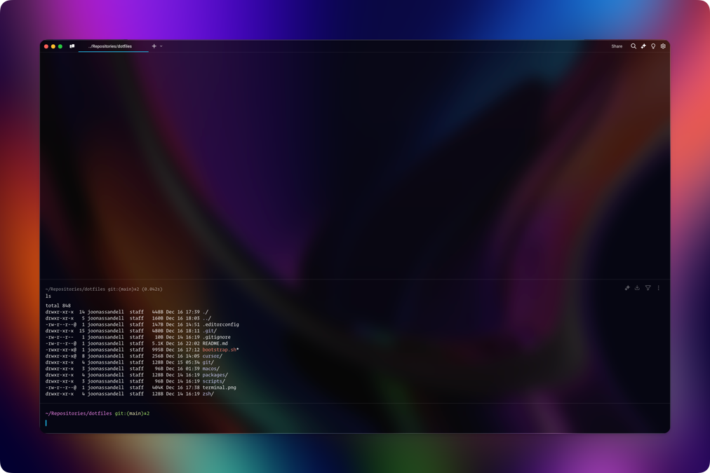

# Dotfiles of Joonas Sandell

I maintain this repository as my personal dotfiles. Last tested succesfully with macOS `Sequoia 15.1`.



## Getting started

Make sure you're connected to the internet and logged in to App Store.

```shell
# 1. Install brew and follow the instructions for adding `brew` to the path
/bin/bash -c "$(curl -fsSL https://raw.githubusercontent.com/Homebrew/install/HEAD/install.sh)"

# 2. Install git, and then a open new terminal window
brew install git

# 3. Create `Repositories` directory and clone this repository
mkdir ~/Repositories && cd ~/Repositories
git clone https://github.com/joonassandell/dotfiles.git && cd dotfiles

# 4. Setup and install packages. Prepare to prompt your password frequently as it maybe required.
./bootstrap.sh
```

## Manual setup

<details>
<summary>
Perform manual configurations after completing the automatic setup especially if you're setting up a new machine
</summary>

- [Synology Drive](https://www.synology.com/en-global/dsm/feature/drive)
  - Configure first before everything
  - Check the `Locally deleted files will be removed from your NAS` and `Use minimalist tray icon`
  - Add `Sync files and folders with the prefix "."` to all synced folders
  - Sync initially only the essential folders: `Drive/1Password` and `Joonas Sandell/Design Resources/Fonts`
- Keyboard shortcuts
  - Modifier Keys:
    - `Control key ^` → `Command ⌘`,
    - `Command ⌘` → `Control key ^`
    - `Function (fn)` / `Globe` → `Command ⌘`
  - App Shortcuts: `Sleep` → `^ ⌥ ⌘ Q` at `All Applications` for [Stream Deck](https://vninja.net/2021/04/15/elgato-stream-deck-sleep-button)
  - Uncheck `Show Spotligh search` and `Show Finder search window`
  - Uncheck `Turn Dock hiding on/off`
  - Uncheck all the Screenshot shortcuts for CleanShot X
- System Settings and related
  - Configure Lock Screen, Screen Saver, Background, Mouse Tracking and Scrolling speed, and Hot corners
  - Check `Use scroll gesture with modifier keys to zoom` at `Accessibility → Zoom`
  - Configure Finder sidebar: Add essential folders and remove Recents etc.
  - Install `Operator Mono` and other fonts from NAS
- [One Password 6](https://c.1password.com/dist/1P/mac4/1Password-6.8.9.pkg): Install and sync it to `~/Drive/1Password`
- [Brave](https://brave.com/):
  - Sync and set it as the default browser
  - Install SoundCloud web app
- [Raycast](https://www.raycast.com): Import settings from `~/Joonas Sandell/Apps/Raycast`
- [Stream Deck](https://www.elgato.com/ww/en/s/welcome-to-stream-deck)
  - Import Stream Deck profiles from `~/Joonas Sandell/Apps/Stream Deck`
  - Add all the plugins and icon packs from [Marketplace](https://marketplace.elgato.com/stream-deck)
- [CleanShot X](https://cleanshot.com/)
  - [Change the license](https://licenses.maketheweb.io)
  - Check `Start at login`
  - Add shorcut: `Capture Area & Copy to Clipboard` to `^ ⇧ ⌘ 4`
  - Add export location to: `~/Joonas Sandell/Photos/Screenshots`
- [Camera Hub](https://www.elgato.com/us/en/s/downloads)
  - Add Snapshop Location to NAS
  - Make sure to check [System Setting](https://help.elgato.com/hc/en-us/articles/30069817477777-Elgato-Camera-Hub-How-to-enable-Virtual-Camera-on-macOS-15-Sequoia) `General/Camera Extenions` → `Elgato Camera Hub`
  - Possibly uninstall the installed `DisplayLink Manager`
- [Sequel Pro](https://sequelpro.com): Symlink favorites `ln -s ~/Joonas\ Sandell/Apps/Sequel\ Pro ~/Library/Application\ Support/Sequel\ Pro`
- [Cursor](https://cursor.com): Install extensions from `cursor/profile/Default.code-profile` at Cursor Profiles
- [Fork](https://git-fork.com)
  - Configure accounts
  - Add `Default Source Folder` → `~/Repositories`
  - Change `Terminal Client` → `Warp`
- [Sync Visual Studio](https://code.visualstudio.com): Sync settings with the native [Settings Sync](https://code.visualstudio.com/docs/editor/settings-sync). I'm not very happy with this approach since it uses [dedicated service](https://code.visualstudio.com/docs/editor/settings-sync#_can-i-use-a-different-backend-or-service-for-settings-sync) and I'd rather like to sync to my own repository.
- [Twitch](https://twitch.tv): Create a standalone app `cd /Applications && bunx nativefier https://www.twitch.tv && mv Twitch-darwin-arm64 Twitch`
- [Slack](https://slack.com): Configure workspaces and [add API token](https://github.com/ellreka/streamdeck-slack-status#setup) for Stream Deck for the wanted workspaces
- [Warp](https://www.warp.dev)
  - Keyboard Shortcuts:
    - Clear `Move Cursor End Within an Executing Command`
    - Clear `Move Cursor Home Within an Executing Command`
    - `Activate Next Tab` → `⌥ ⌘ →`
    - `Activate Previous Tab` → `⌥ ⌘ ←`
    - `Move to Start of Line` → `⌘ ←`
    - `Move to End of Line` → `⌘ →`

There are probably essential settings that are missing from this guide so do whatever is necessary.

</details>

## Copyright

Copyright © [Joonas Sandell](https://x.com/joonassandell). Thanks to [paulirish/dotfiles](https://github.com/paulirish/dotfiles), [aleksik/dotfiles](https://github.com/aleksik/dotfiles) and [https://github.com/Sajjadhosn/dotfiles](https://github.com/Sajjadhosn/dotfiles).
